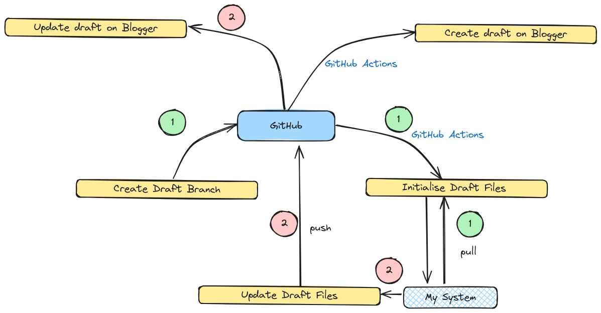

# Blog



## What is it?
It's a,
- System to write and publish blog posts.
- Collection of all notes and resources.
- Scratchpad to craft future posts.

## Tools
- Markdown
- HTML
- Shell
- Jekyll
- Python3


## Steps
1. Create a new branch for blog post draft.

```
git checkout -b draft/someblogtopic 
git push -u origin draft/someblogtopic
```

2. Wait for a minute to initialize the draft.

3. Pull initialized draft `blogpost/someblogtopic`
```
git pull --rebase
```

4. Commit and push changes to the draft branch.

5. Once ready with the blog post, create PR to Main

6. Merge PR to publish the blogpost.


