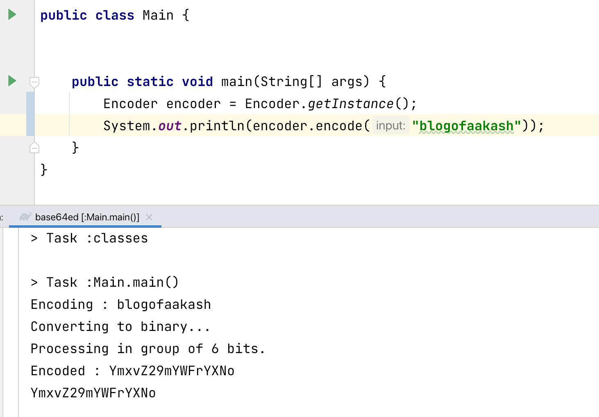

Base64 is popular system that transforms the binary data into limited set of 64 characters. 

For example, text `abc` can be represented in binary as `011000010110001001100011`, Base64 divides this binay data into group of 6 bits `011000 010110 001001 100011` and converts it to as per the encoding table.

Base64 Encoding Table has total 64 (2^6) characters.
- 0 to 25  : A to Z
- 26 to 51 : a to z
- 52 to 61 : 0 to 9
- 62 : Plus symbol '+'
- 63 : Forward slash '/'

Additional symbo '=' is used for padding in case of bits are not in multiple of 6.


According to encoding table, `011000 010110 001001 100011` which is `24 (011000) 22 (010110) 9 (001001) 35 (100011)` converted to `YWJj` in Base64 format.

```java
public class Encoder {

    private static final Encoder ENCODER = new Encoder();

    private static final int ENCODE_BASE = 6;

    private final char[] encodingTable = new char[64];

    private Encoder() {
        initEncodingTable();
    }

    public static Encoder getInstance() {
        return ENCODER;
    }

    public String encode(String input) {
        int[] binary = toBinary(input);
        StringBuilder encoded = new StringBuilder();

        for (int start = 0; start < binary.length; start += ENCODE_BASE) {
            int end = Math.min(start + ENCODE_BASE, binary.length - 1);

            int power = ENCODE_BASE - 1;
            int charIndex = 0;
            for (int j = start; j < end; j++) {
                charIndex += (binary[j] * Math.pow(2, power--));
            }

            encoded.append(encodingTable[charIndex]);
        }

        int pad = binary.length % ENCODE_BASE;
        encoded.append("=".repeat(pad));
        return encoded.toString();
    }

    private int[] toBinary(String input) {
        final int bits = 8;
        int[] binary = new int[input.length() * bits];

        try {
            byte[] bytes = input.getBytes(StandardCharsets.UTF_8);
            int index = 0;
            int max = (int) Math.pow(2, (bits - 1));

            for (byte b : bytes) {
                int val = b;
                for (int i = 0; i < bits; i++) {
                    binary[index++] = ((val & max) == 0 ? 0 : 1);
                    val <<= 1;
                }
            }
        } catch (RuntimeException e) {
            e.printStackTrace();
        }
        return binary;
    }

    private void initEncodingTable() {
        int index = 0;

        for (char i = 'A'; i <= 'Z'; i++)
            encodingTable[index++] = i;

        for (char i = 'a'; i <= 'z'; i++)
            encodingTable[index++] = i;

        for (char i = '0'; i <= '9'; i++)
            encodingTable[index++] = i;

        encodingTable[62] = '+';
        encodingTable[63] = '/';
    }
}
```

