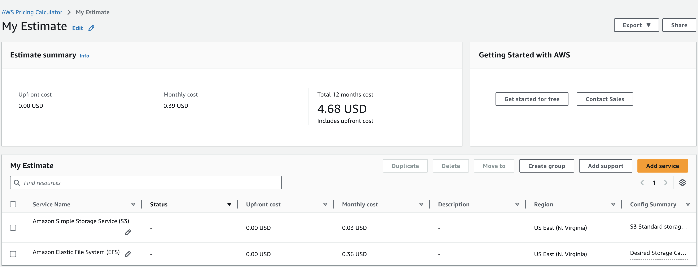
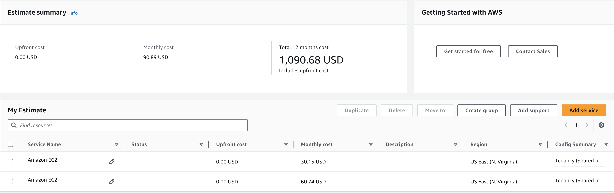

## Introduction
AWS Cloud is one of the biggest cloud player which has captured more than 31% of the cloud service market. The cost of the services is majorly on usage based, the more you use the more you pay. We as an individual or as an organization need to understand how much we can optimize the cost when it comes to AWS because there can be multiple ways to achieve _desired_ results in multiple ways but we are specifically looking for most optimal way.

In many cases we can save cost by taking necessary actions, however, it's important to understand that saving cost should not be the first focus. It can come on the way to building it or even it's ready and now we have some dedicated time to attend the cost related aspect of it.

## Pricing in AWS
This is what AWS say about pricing,

>  You pay for the service you need, for as long as you use them, without compex licensing.

We should understand the "actual" need and "probable" usage before deciding the components and their capacity in cloud service, however, many of times these are two unknows which we can not confidently claim from the start. We can start with a minimal infrastructure and make it flexible to scale which is usually doable in Cloud environment. 

High cost is not a bigger challenge if the usage also brings high value and returns for the business which is usually the case, the more usage is the more business value it should extend at the end of the day.

We can also calculate the price beforehand using [AWS Pricing Calculator](https://calculator.aws/#/). 

## Ways to save money
There can be several ways which you can use to cut down the overall cost. Not all of the options will work for you but based on you current structure you can take up one or two options which can save you some bucks.

When it comes to cost we should also consider the cost we need to pay to the person who is taking care of this optimisation. Someone in the team took that responsibility and spent 20 hours to reduce 1000$ per month and the person got paid 30$/hour is a still a good deal. 

### Service
Choosing the right service for the job is very important when it comes to cost. There are certain services in AWS which you can choose for the same sort of job. There are many options for same purpose for example, S3 and EFS you can use for storage and both _may_ fulfill the requirement. However, the cost different is significant, for 1 GB of storage S3 can cost around 0.03$/month while EFS can cost 0.36$/month  (in US East - N. Verginia).

Ofcourse this doesn't mean you must choose s3 over EFS, both has their right use cases to serve. We need to understand which one we can pick and atleast review the cost as well before deciding the service to use.

### Capacity 
Capacity of the instances we are using in infrastructure makes a huge difference in billing. We can typically guage the machine requirements early based on the processes that we are planning to run on these machines. We usually know beforehand about whether it's computation heavy or memory heavy operations, we usually know approaximately how much primary and secondary storage is required.

There are multiple types of instances available, we need to review our need and find the most suitable one with required configurations.

Details of all instance types can be found [here](https://aws.amazon.com/ec2/instance-types/).

Even though I specifically mentioned EC2 but it applies to RDS as well. Similar strategy can also be applied while deciding S3 storage tier and even the bucket policies to move between tiers for the sake of cost.

We can also review this in AWS Cost Explorer which can help in right sizing the instances.

### Reserve
Choose reserved instances over on demand instance if we are sure that we will need them for atleast year or ever more than that. Reserved instance pricing is locked in and not completely based on usage, while on demand will be billed on usage. Ultimately, you end up saving upto 70% for 3 year term.

If we choose reserved `t3.large` instance for three years vs on demand instnace the monthly expense reduces by 50%. This difference will increase for high end instances upto 75%.

### Alerts
We can enable the billing alerts based on the billing metrics so that in advance we get to know about the possible cost for given month. We can get an estimation in advance so that we can prepare and even take action to reduce the cost if possible.

### Auto Transition
There are different options available in AWS to save money by shifting to tier as per the user. S3 Intelligent Tiering is one of the good example. It automatically detects the right fit for the object and moves it to most cost effective storage. Not necessarily this will fit all the usecases but ensure to explore such options for the service you are using so that we don't miss an opportunity to save money.

### Review & Clean Up
Regular review and clean up unused resources may look unproductive or boring but 30 minute connect every month or quarter can definitely help to save a lot of money. Work pressure or busy schedule may pile up some unused ec2 machines, volumes, buckets etc. which we should regularly keep in check.

### Alternative Cloud
This is not an option all the time but nowadays most major cloud provider services are durable and robust, if cost can be major factor don't stick to one cloud provider and explore other alternatives which can be a huge saving in a longer run, rest assured quality and performance is not compromised.

## Conclusion
In current situation of booming cloud services and competitive environment between cloud providers, we should be vigilant about the different factor in the service that we consume and the long term repurcissions, when it comes to cost. There are several ways which we can try to cut down cost as much as possible without compromising on the quality and performance of the system. However, being ignorant about cost and pricing may end up with wasting your money which could have been utilised better.
