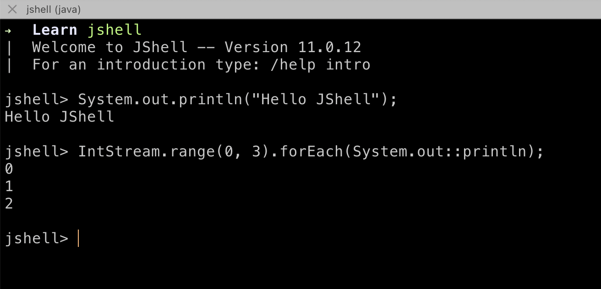

Java 8 is still extensively used in the industry and many applications will gradually shift to newer Java version, especially the LTS versions. 

In this post we will take a look at the evolution happened in Java language from Java 9 to Java 19. Note that each version comes with many improvements, bug fixes and variety of features, we will cover the ones which are majorly used and can impact our day to day developement.

## Java 9

#### Factory methods for collection
```
    List immutableL = List.of(1, 2, 3);
    Map immutableM = Map.of(1, "ONE", 2, "TWO", 3, "THREE")
```
JShell: Java Shell, or REPL (Read Evaluate Print Loop) to execute java constructs directly in command line.


#### Private methods in interface. 
This will avoid code duplication and better separation of concern when it comes to implementing default and static methods in interface.
```
    interface Student {
    private String joinNames(String firstName, String lastName) {
        return String.join(firstName, " ",lastName);
    }
    private static String schoolName() {
        return "Some School";
    }

    default String id(String firstName, String lastName) {
        String fullName = joinNames(firstName, lastName);
        return schoolName() + "\n" + fullName;
    }
}
```

#### Step in direction to optimize String concatenation.

For the given class,
```
public class Test {
    public static void main(String[] args) {
        String str = args[0] + " and " + args[1];
    }
}
```

If we compile and check the bytecode, we can notice significant different in the way concatenation is handled. 

In Java 8,
```
➜  java git:(main) ✗ java -version 
openjdk version "1.8.0_362"
OpenJDK Runtime Environment (build 1.8.0_362-bre_2023_01_22_03_30-b00)
OpenJDK 64-Bit Server VM (build 25.362-b00, mixed mode)
➜  java git:(main) ✗ clear           
➜  java git:(main) ✗ java -version
openjdk version "1.8.0_362"
OpenJDK Runtime Environment (build 1.8.0_362-bre_2023_01_22_03_30-b00)
OpenJDK 64-Bit Server VM (build 25.362-b00, mixed mode)
➜  java git:(main) ✗ javac Test.java
➜  java git:(main) ✗ javap -c  Test 
Compiled from "Test.java"
public class Test {
  public Test();
    Code:
       0: aload_0
       1: invokespecial #1                  // Method java/lang/Object."<init>":()V
       4: return

  public static void main(java.lang.String[]);
    Code:
       0: new           #2                  // class java/lang/StringBuilder
       3: dup
       4: invokespecial #3                  // Method java/lang/StringBuilder."<init>":()V
       7: aload_0
       8: iconst_0
       9: aaload
      10: invokevirtual #4                  // Method java/lang/StringBuilder.append:(Ljava/lang/String;)Ljava/lang/StringBuilder;
      13: ldc           #5                  // String  and
      15: invokevirtual #4                  // Method java/lang/StringBuilder.append:(Ljava/lang/String;)Ljava/lang/StringBuilder;
      18: aload_0
      19: iconst_1
      20: aaload
      21: invokevirtual #4                  // Method java/lang/StringBuilder.append:(Ljava/lang/String;)Ljava/lang/StringBuilder;
      24: invokevirtual #6                  // Method java/lang/StringBuilder.toString:()Ljava/lang/String;
      27: astore_1
      28: return
}
```

In Java 9,

```
➜  java git:(main) ✗ java -version 
openjdk version "9"
OpenJDK Runtime Environment (build 9+181)
OpenJDK 64-Bit Server VM (build 9+181, mixed mode)
➜  java git:(main) ✗ javac Test.java
➜  java git:(main) ✗ javap -c  Test 
Compiled from "Test.java"
public class Test {
  public Test();
    Code:
       0: aload_0
       1: invokespecial #1                  // Method java/lang/Object."<init>":()V
       4: return

  public static void main(java.lang.String[]);
    Code:
       0: aload_0
       1: iconst_0
       2: aaload
       3: aload_0
       4: iconst_1
       5: aaload
       6: invokedynamic #2,  0              // InvokeDynamic #0:makeConcatWithConstants:(Ljava/lang/String;Ljava/lang/String;)Ljava/lang/String;
      11: astore_1
      12: return
}
```

Notice the multiple `StringBuilder` invocations in case of Java 8, which is replaced with `makeConcatWithConstants` in Java 9.

## Java 10

#### Local variable type interface, use `var` to declare.
```
    var i = 1;
    var str = "Hello";
    var student = getStudent();
```

#### Static factory methods to create immutable copy of Collection,
```
    List<String> immutable = List.copyOf(otherList);
```

`orElseThrow()` in Optional
```
    Optional<Object> optional = Optional.ofNullable(null);
    optional.orElseThrow(() -> new RuntimeException("Something went wrong!"));
```

## Java 11 (LTS)

#### Execute Java file directly without compiling with `javac`. 
`java` command internally takes care of the compilation.
Some helper methods for `String`
```
String str = "Hello";
boolean isBlank = str.isBlank();
str.lines().forEach(System.out::println);
str = str.strip();
// str.stripLeading();
//  str.stripTrailing();
```

#### Removed deprecated packages,
```
java.xml.ws
java.xml.bind
java.activation
java.xml.ws.annotation
java.corba
java.transaction
java.se.ee
jdk.xml.ws
jdk.xml.bind
```

#### Make file read and write convenient,

```
Path path = Files.writeString(Files.createTempFile("temporary", ".txt"), "Something to write!");

String fileContent = Files.readString(path);
System.out.println(fileContent);
```

## Java 12

#### Switch can be an expression, changes are in preview.

Before Java 12
```
Animals animal = Animals.COW;

switch (animal) {
    case COW:
    case GOAT:
        System.out.println("Herbivore");
        break;
    case TIGER:
    case LION:
        System.out.println("Carnivore");
        break;
}
```

Can now be reduced to,
```
String animalType = switch (animal) {
    case COW, GOAT -> "Herbivore";
    case TIGER,  LION -> "Carnivore";
};
```

#### No need to typecast for `instanceof`,
```
if(object instanceof String) {
    System.out.println(((String)object).toUpperCase());
}
```
but now you can do,
```
if(object instanceof String str) {
    System.out.println(str.toUpperCase());
}
```

#### Compare files,
```
try {
    Path filePath1 = Files.createTempFile("abc1", ".txt");
    Path filePath2 = Files.createTempFile("abc2", ".txt");

    Files.writeString(filePath1, "Hello!");
    Files.writeString(filePath2, "Hello! (Diff)");

    long mismatchIndex = Files.mismatch(filePath1, filePath2);
    if(mismatchIndex == -1) {
        System.out.println("Both files are same!");
    } else {
        System.out.println("Mismatch found at " + mismatchIndex);
    }
} catch (IOException e) {
    throw new RuntimeException(e);
}
```

**Output**

```
Mismatch found at 6
```

String Identation,

```
String str = "Hello";
for(int i = 0 ; i < 5; i++) {
    System.out.print(str.indent(i));
}
```

**Output**

```
Hello
 Hello
  Hello
   Hello
    Hello
```

Convenient method to transform String,

```
String numbers = "1:ONE,2:TWO,3:THREE";
Map<Integer, String> map = numbers.transform(input -> {
    Map<Integer, String> output =
        Arrays.stream(input.split(","))
            .collect(Collectors.toMap(i -> Integer.parseInt(i.split(":")[0]),
                i -> i.split(":")[1]));
    return output;
});
System.out.println(map);
```

## Java 13

#### Text block support in String,
```
String textBlock = """
    I can write anything,
    without adding \\n in the String.
    """;
System.out.println(textBlock);
```

#### New Methods in String for format,
```
String anything = "Hello %d and %s".formatted(1, "ONE");
```
Intoduced `yield` in switch case, this will replace the `break` for cases where we want to return the number. Difference between `yeild` and `return` is that `yeild` will return the value to `switch` invocation while `return` will return the value to the caller of the method.
```
int answer = switch (number) {
    case 1:
    case 3:
    case 5:
    case 7:
        yield number;
    default:
        yield -1;
};
```

## Java 14

#### Preview of `records`, a data class.
```
record Person(String name, int age){}
```
Can be used,
```
Person person = new Person("Human", 999);
System.out.printf("Person %s, age %d\n", person.name(), person.age());
```
Things to note about `record`
- Can not extend, can not be extended by class
- Can not be abstract
- Allows static fields and methods 
- Instance fields can be declared during initialization.
- Declared fields are private and final

```
record Person(String name, int age){
    // int anything = 0; // Not allowed
    static int anything = 0;

    public String personDetails() {
        return String.format("Person %s, age %d\n", name(), age());
    }
    Person {
        if(name == "Human") {
            throw new RuntimeException("Invalid name");
        }
    }
}
```

#### Records can implement interfaces,
```
interface Human {
    public String personDetails();
}

record Person(String name, int age) implements Human{
    public String personDetails() {
        return String.format("Person %s, age %d\n", name(), age());
    }
}
```
It can support multiple constructors as well,
```
record Person(String name, int age){
    public Person() {
        this("Human", 9999);
    }
    public Person (int age) {
        this("Human", age);
    }
}
```
Allow trailing space in text block,
```
String textBlock = """
    I can write anything,
    without adding \\n in the String.\s\s\s
    """;
System.out.println(textBlock);
```

## Java 15

#### Preview of `sealed` classes or interfacse, 

to allow only specific types which can extend or implement respectively.

```
public abstract sealed class Animal permits Herbivore, Carnivore {
}

final class Herbivore extends Animal{}
sealed class Carnivore extends Animal{}

//class Unknown extends Animal{} // Not allowed to extend
```

Subclass of a sealed class must have either of the following modifiers,
- `sealed` : Will allow to be extended further by permitted classes.
- `non-sealed` : Will allow to be extended further by any classes.
- `final` : Will not allow to be extended further.

```
public abstract sealed class Animal permits Herbivore, Carnivore, Omnivore {
}

final class Herbivore extends Animal {}
sealed class Carnivore extends Animal permits  Tiger{}
non-sealed class Omnivore extends Animal {}

final class Tiger extends Carnivore{}
```

#### Records can implement the sealed interfaces,

```
sealed interface Food permits Creature {
    void doSomething();
} 
record Creature(String name) implements Food {
    @Override
    public void doSomething() {
        System.out.println("Anything");
    }
}
```

## Java 16

#### Pattern matching in `instanceof` no longer makes variable implicitly `final`
```
if(object instanceof String) {
    object = String.format("Result %s", object); // Would give compile time error prior to Java 16.
    System.out.println(object.toUpperCase());
}
```

#### New Vector API, incubator.
```
int[] odd = {1, 3, 5, 7};
int[] even = {2, 4, 6, 8};
var vector1 = IntVector.fromArray(IntVector.SPECIES_128, odd, 0);
var vector2 = IntVector.fromArray(IntVector.SPECIES_128, even, 0);
var vector3 = vector1.add(vector2);
System.out.println(vector3);
```
**Output**
```
[3, 7, 11, 15]
```
Note that, to run the program you will need to add the module otherwise it won't be visible.
```
 java --add-modules jdk.incubator.vector JavaMainClass
```

## Java 17 (LTS)

#### `null` in switch,
```
switch (number) {
    case 1, 2, 3 -> System.out.println("Valid");
    case null -> System.out.println("Not available");
    default -> System.out.println("Invalid");
}
```

#### Pattern matching in switch,
```
String value = switch (obj) {
    case Integer i -> "Integer";
    case Long l    -> "Long";
    case Double d  -> "Double";
    case String s  -> "String";
    case null -> "NULL";
    default -> obj.toString();
};
```

## Java 18

#### Introduce @snippet in JavaDoc to write code in comments,

```
/**
* {@snippet:
*  int a = 10;
* }
*/
public void testMethod() {

}
```

#### Finalization is deprecated. 
The use of `finalize()` method is discouraged and the support will be removed in future.

## Java 19

#### Preview Virtual Threads

lightweight threads which effectively shares the platform thread for optimal hardware utilisation.

```
ExecutorService executorService = Executors.newVirtualThreadPerTaskExecutor();
```

#### Structured Concurrency (Incubator)
Sounds interesting, it enables to consider multiple threads as a unit. This will going to give better control over multithreaded programs.