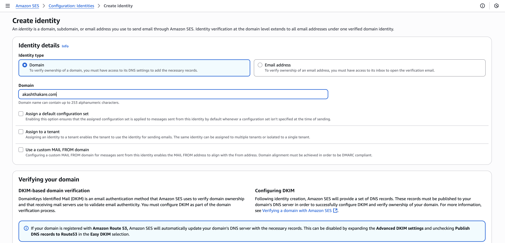
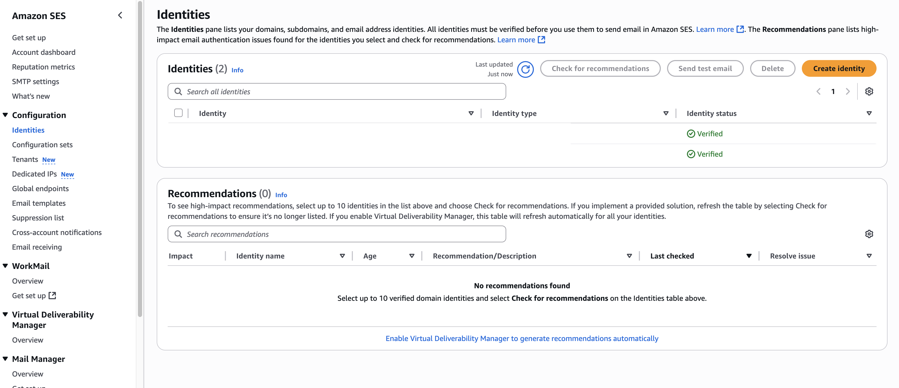
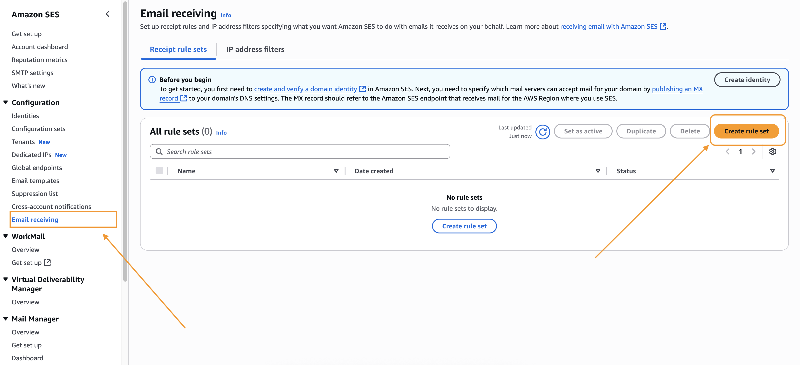
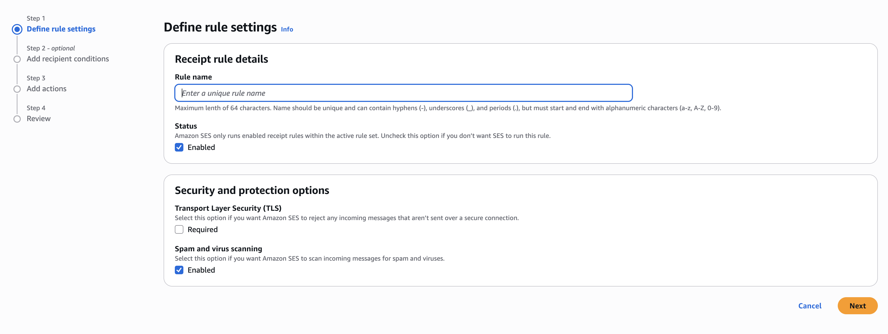
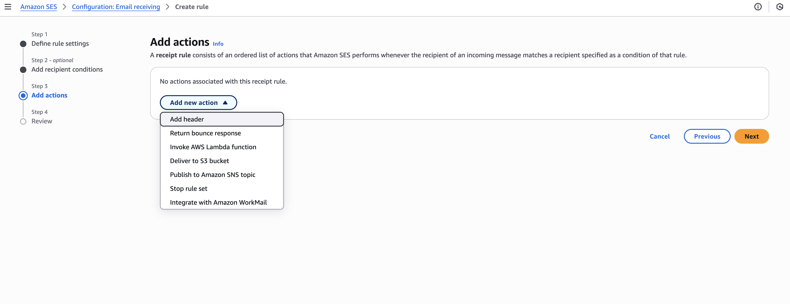
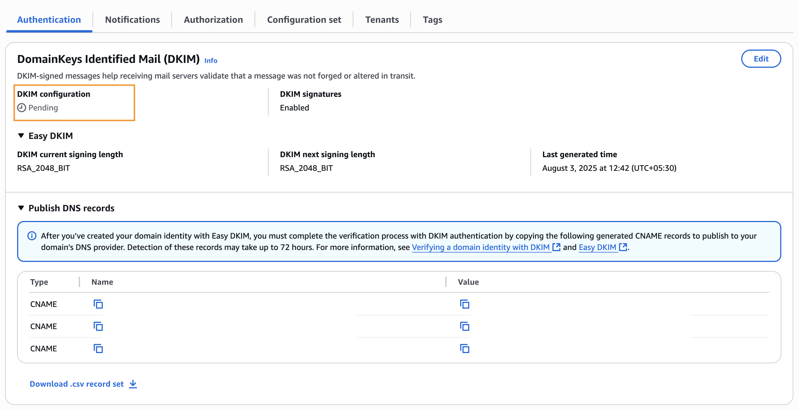
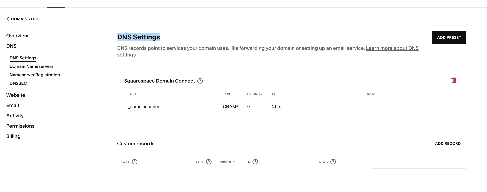
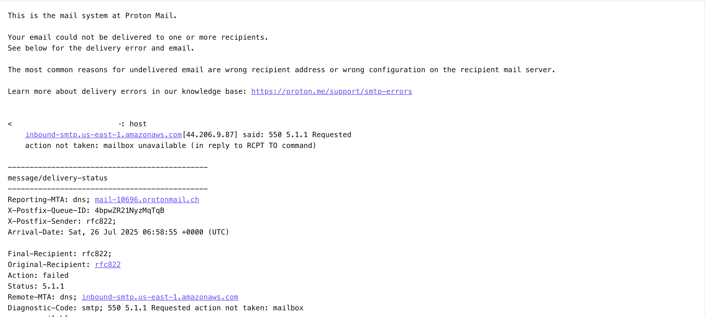

# Introduction
Amazon SES (Simple Email Service) email receiving has an interesting take and opens up many possibilities of integration and workflows. If you want to process your email content and act on it for you email domain, SES can be a good option to explore. This can enable you to do many things in marketing, sales, tracking and even managing your mailbox effectively.

In this blog post we will going to explore email receiving functionality of SES.

# Email Receiving

In AWS SES you can enable email receiving, once enabled you have several options to analyse, treat, parse or act on you received email in AWS.

The steps to set up things for your registered domain (can be in Route53 or any other third party) includes following.

## Create Identity


We first need to register the domain of which email we want to capture and process. Once the identity is verified we are ready to configure email receiving part.



This step managed to establish a connection between our domain and AWS SES, but this is not finished yet. 

We also need to inform our domain provider to forward emails to SES. There are two steps involved for this,
- MX Record for receiving email
- TXT record for domain verification
- CNAME (DKIM) for authentication (Optional)

The MX Record part is crucial, to set email handling to SES, set the region as per the SES.
```
Type: MX
Name: akashthakare.com.
Value: 10 inbound-smtp.<region>.amazonaws.com
```

TXT record for domain verification,

```
Type: TXT
Name: _amazonses.akashthakare.com
Value: "something-random-for-verification"
```

## Create Rule Set

Now it's time to setup email receiving for our domain. We will going to create a RuleSet.



Rule set is a collection of rule which helps SES to decide what to do on the incoming mails for the given identity (domain). For example, if email received for  `contact@akashthakare.com` I simply want to reply with "Thank you for contacting! I will surely get back to you soon. :)". This is just a simple example but you can have more complex rules and customisations in the ruleset.


Each rule set will contain one or more rules where we can configure receipient condition and action associated with it





We can see, multipl options are there on email receipt, especially invoking lambda, storing email to S3 for processing later and publish to SNS topic would enable us to do so many interesting things. 

For example,
- Once email is stored in S3, periodically we can analyse and automatically respond to the email using LLM (Open AI/GPT-4).
- Job applications can be reviewed if the attached resumes are stored in S3 and processed later by background jobs.
- Categorisation of emails and cleaning up emails which you don't want to respond to, in a direction to fully managed mailbox.
- Daily/Monthly email summary to your inbox after processing all the emails.
- Store email data in database and visualise it with quicksight 
- and many more...

Once we have ruleset and the rules configured we need to enable SES to be the receiving party from the domain registar. But importantly mark the ruleset and rule as active so that they can start acting on the received email based on the configuration.


## Auto Reply or Sending Email from SES
For enabling auto reply or sending mail from SES we need to add following records in DNS settings,
- TXT records for SPF
- TXT record for DMARC
- CNAME records for DKIM

### SPF (Sender Policy Framework)
If only SES would allow to send email.
```
Type: TXT
Name: akashthakare.com
Value: v=spf1 include:amazonses.com ~all
```

### DMARC (Domain based Message Authentication Reporting & Conformance)
This entry tells what action to take for unauthenticated emails.

```
Type:TXT
Name: _dmarc	
Value: v=DMARC1; p=quarantine; rua=mailto:dmarc@akashthakare.com
```

### DKIM (DomainKeys Identified Mail)
We can see the CNAME that are given by SES needs to be configured in DNS Setting of the Domain provider to verify the identity, as currently it's in 'Verification pending' state.




This may take hours to days to get verified. Once the verification is complete we can expect that the email configured as per the recepient condition in rule would drop into SES.

## Test 
Once the set up is in place after verification, we can send to the configured email as per the rulset to confirm the mail is received and necessary action has been taking place after receiving the email. In case there is an issue with the configuration SES would reject the email and you may see following response to the sent email.

