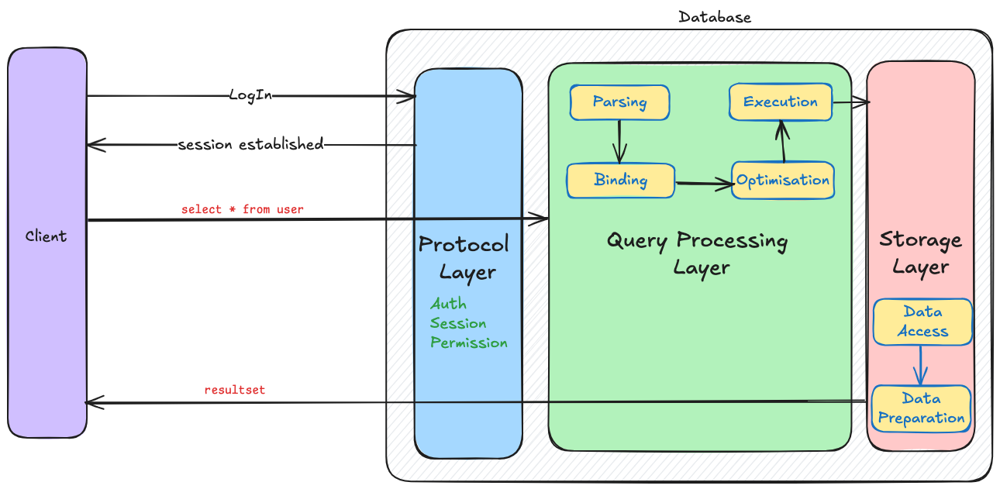

## Introduction
SQL (Structured Query Language) is a language designed to perform operations on relational databases (RDBMS). Different database systems have implemented or tweaked their own SQL parsing and execution logic but fundamentally the all follow the same blueprint.

In this post we will try understand the journey of the SQL query.

## Architecture
SQL Database engine has primarily two components - Compiler and Virtual Machine. Compiler is responsible to convert human readable query to machine understandable bytecode, which further understood and executed by the virtual machine.

SQL systems majorly follows a three layer architecture,
- Protocol Layer
- Query Processing Layer
- Storage Layer

### Protocol Layer
This layer is responsible for the communication takes place between the client and the SQL server using network protocol.

Authentication takes place in this layer; when we login to the database using the credentials.

Common errors that we observe in this layer includes following,
- Connection failure
- Hand shake failure
- Authentication errors
- Protocol mismatch etc.

### Query Processing Layer
When we want to learn about internal working of SQL, we first need to understand different phases a query goes through.

A query goes through many phases to finally return the required result.

- **Parsing**: Build a parse tree from a query if it's valid.
- **Binding**: Build a query processor tree using parse tree.
- **Optimization**: Determine effcient execution plan.
- **Execution**: Carry out chosen execution plan.

### Storage Layer
This layer manages how data is physically stored and accessed.

The smallest data unit in storage is called page which is generally of 8KB. When there is a request to fetch the data it first checks in buffer (cache), if the data page is present it uses it otherwise looks into data file.

Two additional mechanisms background job, to clean up dirty pages, and transcation log, for durability and recovery are in place.

## Journey
We understood the basic architecture of the database system but the journey of query is still not fully visible. 

The end-to-end journey of the SQL query under the hood is as follows:

**Client**
- The client (e.g. MySQL Workbench) send the SQL statement `SELECT * from user` to the database server.

**Connection**
- Query travels over the network using the dedicated protocols.
- Authentication and user permissions are verified here.
- A session is established!

**Parsing**
- Query received at SQL server.
- Query is parsed and broken into token for further processing.
- Syntax validation takes place.

**Binding**
- Checks whether table and column actually exists?
- Data types checked

**Optimization**
- Optimizer evaluates possible plans to get data.
- Chooses most efficient execution plan.

**Data Access**
- Execution plan triggers the data page retrival
- First checks in cache!
- Transaction logs are captured.

**Fetch Rows**
- Rows of user table are scanned.
- If index is present rows are read as per the index.

**Concurrency**
- Acquire lock on data pages; depending on transaction isolation level.

**Result**
- Engine assembles the rows as per the `SELECT` criteria, 
- Packed in resultset and sent back to the client

**Logging**
- Query execution detail, resource usage, errors etc. are captured for monitoring.

Individual database system has their own set of implementation and modifications to this architecture. We will deep dive into into each layer and it's components individually in upcoming post for better clarity.